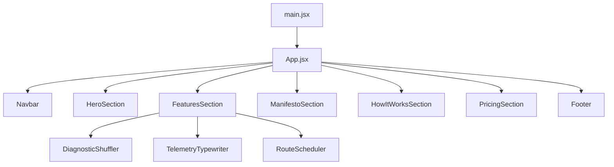
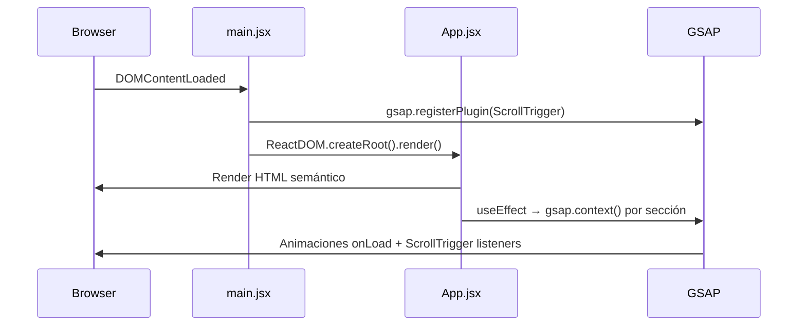

# Design Document — Pa'lla Landing Page

## Overview

Pa'lla es un B2B marketplace panameño que conecta tiendas de barrio (pulperías, abarrotes, mini-supermercados) con proveedores mayoristas. Este documento describe el diseño técnico del landing page de alta fidelidad que sirve como presencia web principal y herramienta de conversión.

El landing page es una Single Page Application (SPA) construida con React 19 + Vite. Su objetivo dual es:
1. Convertir tenderos panameños en usuarios registrados.
2. Comunicar credibilidad y tracción a inversores.

La experiencia visual es cinematográfica: animaciones pesadas con GSAP 3 + ScrollTrigger, tipografía de gran escala, micro-UIs interactivas y una paleta de marca consistente.

### Decisiones de diseño clave

- **React 19 + Vite** sobre Next.js: el landing es estático, no requiere SSR ni routing complejo. Vite ofrece HMR rápido y bundles optimizados.
- **Estrategia de animaciones dual**: GSAP 3 + ScrollTrigger para sticky stack, parallax y timelines complejos; Framer Motion para componentes Magic UI (hover effects, entrance animations de cards).
- **Magic UI + shadcn/ui** sobre CSS puro: componentes pre-construidos con animaciones cinematográficas (MagicCard, BorderBeam, NumberTicker, TypingAnimation) que aceleran el desarrollo sin sacrificar personalización.
- **Tailwind CSS v3** sobre CSS Modules: utilidades atómicas aceleran el desarrollo y mantienen consistencia con el sistema de diseño.
- **CSS Noise via SVG turbulence** sobre imágenes PNG: menor peso, escalable, aplicable como pseudo-elemento global.

---

## UI Component Library

### Magic UI + shadcn/ui

Magic UI está construido sobre shadcn/ui (misma base Radix UI + Tailwind CSS), lo que garantiza compatibilidad total con el stack existente. Se usa para componentes de landing page con animaciones pre-construidas.

**Componentes Magic UI a usar:**

| Componente | Sección | Uso |
|------------|---------|-----|
| `MagicCard` | FeaturesSection, PricingSection | Cards con efecto de luz que sigue el cursor |
| `BorderBeam` | PricingSection (plan Crecimiento) | Borde animado giratorio en la tarjeta destacada |
| `NumberTicker` | HeroSection | Animación de conteo para las métricas (15,000+, 24h, 5-15%) |
| `TypingAnimation` | TelemetryTypewriter | Reemplaza la lógica manual del typewriter |
| `AnimatedBeam` | HowItWorksSection | Líneas de conexión animadas entre pasos |
| `Meteors` | HeroSection (fondo) | Efecto de meteoros sobre el overlay del hero |

**Instalación:**
```bash
# Inicializar shadcn/ui
npx shadcn@latest init

# Instalar componentes Magic UI via registry de shadcn
npx shadcn@latest add "https://magicui.design/r/magic-card"
npx shadcn@latest add "https://magicui.design/r/border-beam"
npx shadcn@latest add "https://magicui.design/r/number-ticker"
npx shadcn@latest add "https://magicui.design/r/typing-animation"
npx shadcn@latest add "https://magicui.design/r/animated-beam"
npx shadcn@latest add "https://magicui.design/r/meteors"
```

**Dependencia adicional:**
```bash
npm install framer-motion
```

### Estrategia de animaciones dual

| Tipo de animación | Librería | Justificación |
|-------------------|----------|---------------|
| Sticky stack (HowItWorks) | GSAP + ScrollTrigger | Requiere scroll-pinning y scrub granular |
| Parallax (Manifesto) | GSAP + ScrollTrigger | Control preciso de yPercent con scrub |
| Split-text reveal | GSAP | Stagger y timeline control |
| Hero fade-up stagger | GSAP | Timeline secuencial con delays precisos |
| Card hover effects | Framer Motion (via Magic UI) | MagicCard usa Framer Motion internamente |
| Métricas count-up | Framer Motion (via Magic UI) | NumberTicker usa Framer Motion |
| Typewriter | Framer Motion (via Magic UI) | TypingAnimation reemplaza lógica manual |
| Border animado | Framer Motion (via Magic UI) | BorderBeam usa Framer Motion |

**Regla de convivencia:** GSAP y Framer Motion no deben animar el mismo elemento simultáneamente. GSAP controla elementos de layout/scroll; Framer Motion controla componentes Magic UI encapsulados.

---

## Architecture

La aplicación sigue una arquitectura de componentes plana con un único árbol de renderizado. No hay estado global complejo ni routing — todo vive en `App.jsx` como una secuencia vertical de secciones.



### Flujo de inicialización



### Gestión de animaciones

Cada componente que usa GSAP sigue el patrón:

```js
useEffect(() => {
  const prefersReduced = window.matchMedia('(prefers-reduced-motion: reduce)').matches;
  if (prefersReduced) return; // salida temprana, sin animaciones

  const ctx = gsap.context(() => {
    // definición de timelines y ScrollTriggers
  }, containerRef);

  return () => ctx.revert(); // cleanup en unmount
}, []);
```

Este patrón garantiza:
- Aislamiento de selectores GSAP al scope del componente.
- Cleanup automático al desmontar (sin memory leaks).
- Respeto a `prefers-reduced-motion`.

---

## Components and Interfaces

### Navbar

**Props:** ninguna (lee scroll position internamente)

**Estado interno:**
- `isScrolled: boolean` — controla el estilo glassmorphism

**Comportamiento:**
- `useEffect` con `window.addEventListener('scroll', handler)` → actualiza `isScrolled` cuando `window.scrollY > 50`.
- Links de nav llaman `document.getElementById(sectionId).scrollIntoView({ behavior: 'smooth' })`.
- Mobile: estado `menuOpen: boolean` controlado por botón hamburguesa (Lucide `Menu` / `X`).

**Clases condicionales:**
```
isScrolled → backdrop-blur-[20px] bg-[#1E2A6E]/80
!isScrolled → bg-transparent
```

---

### HeroSection

**Props:** ninguna

**Refs:** `containerRef`, `headlineRef`, `subheadlineRef`, `metricsRef`, `ctaRef`

**Animación onLoad (GSAP):**
```
Timeline staggered fade-up:
  headlineRef   → from { y: 40, opacity: 0 } → delay 0
  subheadlineRef → from { y: 40, opacity: 0 } → delay 0.15
  metricsRef    → from { y: 40, opacity: 0 } → delay 0.30
  ctaRef        → from { y: 40, opacity: 0 } → delay 0.45
```

**Imagen de fondo:** URL Unsplash con overlay CSS `linear-gradient(#1E2A6E, #000000)` a 70% opacidad.

---

### FeaturesSection

Contenedor de las tres micro-UI cards. Layout: grid de 3 columnas en desktop, columna única en mobile.

#### DiagnosticShuffler

**Estado interno:**
- `cards: string[]` — array de labels, orden mutable

**Lógica de rotación:**
```
setInterval(3000ms):
  setCards(prev => {
    const next = [...prev];
    next.push(next.shift()); // unshift(pop()) → mueve frontal al fondo
    return next;
  });
```

**Animación GSAP spring-bounce:**
```
gsap.to(frontCard, {
  y: -20, rotation: -5, opacity: 0, duration: 0.4,
  ease: 'cubic-bezier(0.34, 1.56, 0.64, 1)',
  onComplete: () => { /* reorder DOM */ }
})
```

**Cleanup:** `clearInterval` en return del `useEffect`.

#### TelemetryTypewriter

**Estado interno:**
- `displayText: string` — texto actualmente visible
- `messageIndex: number` — índice del mensaje actual
- `isDeleting: boolean` — fase de borrado

**Lógica del ciclo:**
```
useEffect con setInterval(50ms cuando escribe, 30ms cuando borra):
  if (!isDeleting && displayText === messages[messageIndex]):
    setTimeout(1500ms) → setIsDeleting(true)
  else if (isDeleting && displayText === ''):
    setIsDeleting(false)
    setMessageIndex((i + 1) % messages.length)
  else:
    setDisplayText(isDeleting
      ? displayText.slice(0, -1)
      : messages[messageIndex].slice(0, displayText.length + 1))
```

**Cursor:** `<span>` con clase CSS `animate-blink` (keyframe `opacity: 0 ↔ 1` cada 1s), color `#E8401C`.

**Cleanup:** `clearInterval` + `clearTimeout` en return del `useEffect`.

#### RouteScheduler

**Estado interno:**
- `activeDays: Set<number>` — días activados por el cursor
- `confirmed: boolean` — estado del botón Confirmar

**Refs:** `cursorRef`, `gridRef`

**Secuencia GSAP (timeline):**
```
tl.to(cursor, { x: dayPositions[0] }) → tl.to(cursor, { scale: 0.9 }) → activateDay(0)
→ tl.to(cursor, { x: dayPositions[1] }) → activateDay(1)
→ ... (7 días)
→ tl.to(cursor, { x: confirmBtnPos }) → tl.to(cursor, { scale: 0.9 }) → setConfirmed(true)
→ tl.to({}, { duration: 2, onComplete: resetAnimation })
```

---

### ManifestoSection

**Refs:** `sectionRef`, `line1Ref`, `line2Ref`, `line3Ref`, `line4Ref`

**Animaciones ScrollTrigger:**
```
// Parallax de fondo
gsap.to(bgImage, {
  yPercent: -20,
  scrollTrigger: { trigger: section, scrub: 1 }
})

// Split-text reveal por línea
gsap.from([line1, line2, line3, line4], {
  y: 60, opacity: 0, stagger: 0.2,
  scrollTrigger: { trigger: section, start: 'top 70%' }
})
```

---

### HowItWorksSection

**Refs:** `containerRef`, `card1Ref`, `card2Ref`, `card3Ref`

**ScrollTrigger sticky stack:**
```
// Pin del contenedor
ScrollTrigger.create({
  trigger: container,
  pin: true,
  scrub: 1,
  end: '+=300%'
})

// Al entrar card 2: card 1 → scale(0.9), blur(20px), opacity(0.5)
// Al entrar card 3: card 2 → scale(0.9), blur(20px), opacity(0.5)
```

**Artefactos SVG por tarjeta:**

| Tarjeta | Artefacto | Técnica |
|---------|-----------|---------|
| 01 | Mapa de Panamá con puntos pulsantes | SVG `<circle>` con `animate-pulse`, líneas con `stroke-dashoffset` |
| 02 | Grid 4×4 con scanner | `<div>` grid + línea GSAP `repeat: -1, yoyo: false` |
| 03 | Waveform SVG | `<path>` con `stroke-dashoffset` animado via GSAP |

---

### PricingSection

**Props:** ninguna (datos hardcoded)

**Estructura de datos de planes:**
```js
const plans = [
  { id: 'basic', name: 'Básico', price: 'Gratis', featured: false, ... },
  { id: 'growth', name: 'Crecimiento', price: '$29/mes', featured: true, ... },
  { id: 'pro', name: 'Pro', price: '$79/mes', featured: false, ... },
]
```

**Responsive:** `grid-cols-1 md:grid-cols-3`. En mobile, `order-first` en la tarjeta Crecimiento.

---

### Footer

**Props:** ninguna

**Año dinámico:** `{new Date().getFullYear()}`

**Indicador de estado:** `<span className="animate-pulse bg-green-400 rounded-full w-2 h-2" />`

---

## Data Models

No hay backend ni estado persistente en esta versión. Los únicos modelos de datos son estructuras locales en memoria.

### Plan de Precios

```ts
interface PricingPlan {
  id: 'basic' | 'growth' | 'pro';
  name: string;
  price: string;           // "Gratis" | "$29/mes" | "$79/mes"
  featured: boolean;       // true solo para 'growth'
  badge?: string;          // "Más Popular" para 'growth'
  features: string[];      // lista de beneficios
  ctaLabel: string;
  ctaVariant: 'outline' | 'primary'; // outline = border, primary = bg #E8401C
}
```

### Mensajes del Typewriter

```ts
const TYPEWRITER_MESSAGES: string[] = [
  "Actualizando precios de arroz...",
  "Nuevo lote de aceite disponible",
  "Precio de azúcar actualizado",
  "Stock de bebidas confirmado",
  "Oferta especial en harina detectada",
];
```

### Labels del Diagnostic Shuffler

```ts
const SHUFFLER_LABELS: string[] = [
  "Precio mayorista",
  "Entrega en 24h",
  "Sin mínimo de compra",
];
```

### Días del Route Scheduler

```ts
const WEEK_DAYS: string[] = ['L', 'M', 'M', 'J', 'V', 'S', 'D'];
```

### Pasos del How It Works

```ts
interface HowItWorksStep {
  number: '01' | '02' | '03';
  title: string;
  description: string;
  artifact: 'map' | 'scanner' | 'waveform';
}
```

### Configuración del Sistema de Diseño

```ts
const DESIGN_TOKENS = {
  colors: {
    primary: '#1E2A6E',
    accent: '#E8401C',
    background: '#F5F5F0',
    dark: '#1A1A1A',
  },
  borderRadius: {
    card: 'rounded-[2rem]',
    footer: 'rounded-t-[4rem]',
  },
  fonts: {
    heading: '"Plus Jakarta Sans", "Outfit", sans-serif',
    drama: '"Cormorant Garamond", serif',
    mono: 'ui-monospace, monospace',
  },
} as const;
```

---

## Correctness Properties

*A property is a characteristic or behavior that should hold true across all valid executions of a system — essentially, a formal statement about what the system should do. Properties serve as the bridge between human-readable specifications and machine-verifiable correctness guarantees.*

### Property 1: Invariante de contraste de color

*For any* combinación de color de texto y color de fondo usada en el landing page, el ratio de contraste calculado (WCAG 2.1) debe ser mayor o igual a 4.5:1.

**Validates: Requirements 1.4, 11.5**

---

### Property 2: Reduced motion desactiva animaciones GSAP

*For any* componente que use GSAP, cuando `window.matchMedia('(prefers-reduced-motion: reduce)').matches` es `true`, ningún elemento del componente debe tener transforms o cambios de opacidad aplicados por GSAP (el `gsap.context()` debe retornar sin crear animaciones).

**Validates: Requirements 11.3**

---

### Property 3: Links de navegación hacen scroll al target correcto

*For any* enlace de navegación (navbar links y hero CTA), al hacer click, el `id` del elemento al que se hace scroll debe coincidir con el `href` del enlace, independientemente de la posición de scroll actual.

**Validates: Requirements 2.7, 3.9**

---

### Property 4: Navbar aplica glassmorphism para cualquier scroll > 50px

*For any* valor de `window.scrollY` mayor a 50, el componente Navbar debe tener aplicadas las clases de glassmorphism (`backdrop-blur-[20px]` y fondo `#1E2A6E` a 80% opacidad). Para cualquier valor ≤ 50, el fondo debe ser transparente.

**Validates: Requirements 2.3**

---

### Property 5: Navbar colapsa a hamburguesa en viewport < 768px

*For any* viewport con ancho menor a 768px, los enlaces de navegación deben estar ocultos y el botón hamburguesa debe ser visible. Para cualquier viewport ≥ 768px, los enlaces deben ser visibles y el botón hamburguesa oculto.

**Validates: Requirements 2.8**

---

### Property 6: El ciclo del Diagnostic Shuffler es una permutación cíclica

*For any* orden inicial de las 3 tarjetas del Diagnostic Shuffler, después de exactamente 3 rotaciones (cada una moviendo la tarjeta frontal al fondo), el orden de las tarjetas debe ser idéntico al orden inicial. Es decir, la operación de rotación es una permutación cíclica de período 3.

**Validates: Requirements 4.3**

---

### Property 7: El ciclo del Telemetry Typewriter es infinito y sin leaks

*For any* índice de mensaje en el array `TYPEWRITER_MESSAGES`, después de que el typewriter completa ese mensaje (escribe y borra), el siguiente mensaje que comienza a escribirse debe ser `messages[(currentIndex + 1) % messages.length]`. Al desmontar el componente, no deben quedar intervalos o timeouts activos.

**Validates: Requirements 5.1, 5.3**

---

### Property 8: Route Scheduler activa correctamente cada día

*For any* día en el grid semanal (índices 0–6), cuando la secuencia de animación del cursor llega a ese día, ese día debe tener el estado visual activo (clase CSS con fondo `#1E2A6E`). Los días no visitados aún deben permanecer en estado inactivo.

**Validates: Requirements 6.3**

---

### Property 9: Route Scheduler reinicia al estado inicial tras confirmación

*For any* estado del Route Scheduler donde `confirmed === true`, después de 2 segundos, el estado debe volver al estado inicial: `activeDays` vacío, `confirmed === false`, y la animación del cursor reiniciada desde el principio.

**Validates: Requirements 6.5**

---

### Property 10: Cada tarjeta del How It Works tiene número de paso y título

*For any* tarjeta en el How It Works Section (de las 3 existentes), el elemento renderizado debe contener un número de paso del formato `"0N"` (donde N ∈ {1, 2, 3}) y un título descriptivo no vacío.

**Validates: Requirements 8.6**

---

### Property 11: Cada plan de precios renderiza su lista de features

*For any* plan de precios en el array `plans` (Básico, Crecimiento, Pro), el componente renderizado debe mostrar al menos un elemento en su lista de features, y cada feature debe ser una cadena no vacía.

**Validates: Requirements 9.4**

---

### Property 12: Plan destacado aparece primero en mobile

*For any* viewport con ancho menor a 768px, el plan con `featured: true` (Crecimiento) debe aparecer antes en el orden visual que los planes no destacados.

**Validates: Requirements 9.5**

---

### Property 13: El año del copyright es siempre el año actual

*For any* momento en que el Footer es renderizado, el texto de copyright debe contener el año retornado por `new Date().getFullYear()` en ese momento.

**Validates: Requirements 10.5**

---

### Property 14: Todas las imágenes tienen atributo alt no vacío

*For any* elemento `` en el árbol de componentes renderizado, el atributo `alt` debe existir y ser una cadena no vacía y descriptiva (longitud > 0).

**Validates: Requirements 11.4**

---

### Property 15: Sin overflow de contenido en viewport de 320px

*For any* sección del landing page renderizada en un viewport de 320px de ancho, ningún elemento debe tener `scrollWidth` mayor que el `clientWidth` del viewport (sin overflow horizontal).

**Validates: Requirements 11.2**

---

## Error Handling

### Imágenes de Unsplash no disponibles

Si la imagen de Unsplash del Hero o Manifesto no carga (error de red, CDN caído), el overlay gradiente CSS garantiza que el texto sea legible sobre el fondo de color sólido `#1E2A6E`. No se requiere manejo explícito de error — el `background-color` de fallback actúa como degradación elegante.

```css
/* Fallback en HeroSection */
background-color: #1E2A6E; /* visible si la imagen falla */
background-image: url('...');
```

### GSAP no disponible o falla al cargar

Si GSAP falla (bundle corruption, bloqueador de scripts), los componentes deben renderizar su estado final visible sin animaciones. Todos los elementos deben tener estilos CSS base que los hagan visibles sin depender de GSAP para su estado inicial.

Regla: **nunca usar `opacity: 0` como estado inicial en CSS** — solo GSAP puede establecer ese estado como punto de partida de una animación.

### Typewriter — cleanup en unmount

El `useEffect` del TelemetryTypewriter debe limpiar tanto el `setInterval` como cualquier `setTimeout` pendiente al desmontar. Si no se hace, el setState en un componente desmontado genera warnings de React y potenciales memory leaks.

```js
return () => {
  clearInterval(intervalRef.current);
  clearTimeout(timeoutRef.current);
};
```

### Route Scheduler — cleanup de timeline GSAP

El timeline de GSAP del RouteScheduler debe ser killed en el cleanup del `useEffect` para evitar que callbacks de `onComplete` ejecuten `setState` en componentes desmontados.

```js
return () => {
  tl.kill();
  ctx.revert();
};
```

### Viewport muy pequeño (< 320px)

El diseño no garantiza funcionalidad en viewports menores a 320px. Se acepta degradación visual en esos casos. El mínimo soportado es 320px según Requirement 11.2.

### ScrollTrigger en SSR

No aplica en esta versión (Vite SPA puro). Si en el futuro se migra a SSR, todos los `ScrollTrigger.create()` deben estar dentro de `useEffect` (ya lo están por diseño) para evitar errores de `window is not defined`.

---

## Testing Strategy

### Enfoque dual: Unit Tests + Property-Based Tests

Ambos tipos son complementarios y necesarios:

- **Unit tests**: verifican ejemplos concretos, casos de borde y condiciones de error.
- **Property tests**: verifican propiedades universales sobre rangos de inputs generados aleatoriamente.

Los unit tests atrapan bugs concretos; los property tests verifican correctitud general.

### Herramientas

| Tipo | Librería | Justificación |
|------|----------|---------------|
| Unit tests | Vitest + React Testing Library | Integración nativa con Vite, API compatible con Jest |
| Property tests | fast-check | Librería PBT madura para JavaScript/TypeScript, generadores ricos |
| Rendering | @testing-library/react | Queries semánticas, simula comportamiento de usuario |
| Accesibilidad | jest-axe | Validación automática de reglas WCAG |

### Unit Tests — Ejemplos concretos

Los unit tests se enfocan en:

1. **Renderizado de contenido estático**: verificar que textos, labels y elementos clave están presentes.
2. **Puntos de integración**: verificar que los IDs de sección coinciden con los hrefs de navegación.
3. **Casos de borde**: viewport 320px, scroll exactamente en 50px, array de mensajes vacío.

Ejemplos de unit tests:

```js
// Navbar — estado inicial
test('Navbar muestra fondo transparente en scroll 0', () => {
  render(<Navbar />);
  expect(screen.getByRole('navigation')).not.toHaveClass('backdrop-blur-[20px]');
});

// Footer — año dinámico
test('Footer muestra el año actual', () => {
  render(<Footer />);
  expect(screen.getByText(new RegExp(new Date().getFullYear()))).toBeInTheDocument();
});

// Imágenes — atributos alt
test('HeroSection tiene imagen con alt descriptivo', () => {
  render(<HeroSection />);
  const img = screen.getByRole('img');
  expect(img).toHaveAttribute('alt');
  expect(img.getAttribute('alt').length).toBeGreaterThan(0);
});

// Semántica HTML
test('App renderiza estructura semántica correcta', () => {
  render(<App />);
  expect(document.querySelector('header')).toBeInTheDocument();
  expect(document.querySelector('main')).toBeInTheDocument();
  expect(document.querySelector('footer')).toBeInTheDocument();
  expect(document.querySelector('nav')).toBeInTheDocument();
});
```

### Property-Based Tests — Propiedades universales

Cada propiedad del diseño se implementa como un test PBT con mínimo 100 iteraciones.

**Configuración de fast-check:**
```js
import fc from 'fast-check';
fc.configureGlobal({ numRuns: 100 });
```

**Tag format:** `// Feature: palla-landing-page, Property N: <descripción>`

---

#### Property 1: Invariante de contraste de color
```js
// Feature: palla-landing-page, Property 1: Color contrast >= 4.5:1
test('P1: Todos los pares texto/fondo tienen contraste >= 4.5:1', () => {
  const colorPairs = [
    { text: '#FFFFFF', bg: '#1E2A6E' }, // blanco sobre azul marino
    { text: '#FFFFFF', bg: '#E8401C' }, // blanco sobre rojo-naranja
    { text: '#1A1A1A', bg: '#F5F5F0' }, // carbón sobre crema
    { text: '#FFFFFF', bg: '#1A1A1A' }, // blanco sobre carbón
    { text: '#1E2A6E', bg: '#F5F5F0' }, // azul marino sobre crema
  ];
  colorPairs.forEach(({ text, bg }) => {
    expect(calculateContrastRatio(text, bg)).toBeGreaterThanOrEqual(4.5);
  });
});
```

#### Property 2: Reduced motion desactiva animaciones
```js
// Feature: palla-landing-page, Property 2: prefers-reduced-motion disables GSAP
test('P2: Con prefers-reduced-motion, gsap.context no crea animaciones', () => {
  fc.assert(fc.property(
    fc.constantFrom('HeroSection', 'ManifestoSection', 'HowItWorksSection'),
    (componentName) => {
      // Mock matchMedia para retornar reduce: true
      window.matchMedia = jest.fn().mockReturnValue({ matches: true });
      const gsapSpy = jest.spyOn(gsap, 'context');
      renderComponent(componentName);
      // El contexto GSAP debe retornar sin crear tweens
      expect(gsapSpy).not.toHaveBeenCalledWithAnimations();
    }
  ));
});
```

#### Property 3: Links de navegación hacen scroll al target correcto
```js
// Feature: palla-landing-page, Property 3: Nav links scroll to correct section
test('P3: Cada link de nav hace scroll al section con el id correcto', () => {
  const navLinks = [
    { label: 'Características', targetId: 'features' },
    { label: 'Cómo Funciona', targetId: 'how-it-works' },
    { label: 'Precios', targetId: 'pricing' },
  ];
  fc.assert(fc.property(
    fc.constantFrom(...navLinks),
    ({ label, targetId }) => {
      render(<App />);
      const link = screen.getByText(label);
      const scrollSpy = jest.spyOn(document.getElementById(targetId), 'scrollIntoView');
      fireEvent.click(link);
      expect(scrollSpy).toHaveBeenCalledWith({ behavior: 'smooth' });
    }
  ));
});
```

#### Property 6: Shuffler es permutación cíclica de período 3
```js
// Feature: palla-landing-page, Property 6: Shuffler rotation is cyclic permutation
test('P6: Después de 3 rotaciones el orden de tarjetas es el original', () => {
  fc.assert(fc.property(
    fc.shuffledSubarray(['Precio mayorista', 'Entrega en 24h', 'Sin mínimo de compra'], { minLength: 3, maxLength: 3 }),
    (initialOrder) => {
      let cards = [...initialOrder];
      const rotate = (arr) => { const next = [...arr]; next.push(next.shift()); return next; };
      cards = rotate(rotate(rotate(cards)));
      expect(cards).toEqual(initialOrder);
    }
  ));
});
```

#### Property 7: Typewriter cicla mensajes en orden correcto
```js
// Feature: palla-landing-page, Property 7: Typewriter cycles messages infinitely
test('P7: El siguiente mensaje es siempre (currentIndex + 1) % length', () => {
  fc.assert(fc.property(
    fc.integer({ min: 0, max: TYPEWRITER_MESSAGES.length - 1 }),
    (currentIndex) => {
      const expectedNext = (currentIndex + 1) % TYPEWRITER_MESSAGES.length;
      expect(getNextMessageIndex(currentIndex, TYPEWRITER_MESSAGES.length)).toBe(expectedNext);
    }
  ));
});
```

#### Property 9: Route Scheduler reinicia tras confirmación
```js
// Feature: palla-landing-page, Property 9: Route Scheduler resets after confirmation
test('P9: Estado inicial se restaura después de confirmación', () => {
  fc.assert(fc.property(
    fc.array(fc.integer({ min: 0, max: 6 }), { minLength: 1, maxLength: 7 }),
    (activatedDays) => {
      const { result } = renderHook(() => useRouteScheduler());
      act(() => result.current.activateDays(activatedDays));
      act(() => result.current.confirm());
      act(() => jest.advanceTimersByTime(2000));
      expect(result.current.activeDays.size).toBe(0);
      expect(result.current.confirmed).toBe(false);
    }
  ));
});
```

#### Property 13: Copyright año es el año actual
```js
// Feature: palla-landing-page, Property 13: Copyright year matches current year
test('P13: Footer muestra el año actual en el copyright', () => {
  fc.assert(fc.property(
    fc.date({ min: new Date('2024-01-01'), max: new Date('2099-12-31') }),
    (date) => {
      jest.setSystemTime(date);
      render(<Footer />);
      const year = date.getFullYear().toString();
      expect(screen.getByText(new RegExp(year))).toBeInTheDocument();
    }
  ));
});
```

#### Property 14: Todas las imágenes tienen alt no vacío
```js
// Feature: palla-landing-page, Property 14: All images have non-empty alt
test('P14: Ninguna imagen tiene alt vacío o ausente', () => {
  render(<App />);
  const images = document.querySelectorAll('img');
  fc.assert(fc.property(
    fc.constantFrom(...Array.from(images)),
    (img) => {
      expect(img).toHaveAttribute('alt');
      expect(img.getAttribute('alt').trim().length).toBeGreaterThan(0);
    }
  ));
});
```

#### Property 15: Sin overflow en 320px
```js
// Feature: palla-landing-page, Property 15: No horizontal overflow at 320px
test('P15: Ninguna sección tiene overflow horizontal en 320px', () => {
  Object.defineProperty(window, 'innerWidth', { value: 320 });
  render(<App />);
  const sections = document.querySelectorAll('section');
  fc.assert(fc.property(
    fc.constantFrom(...Array.from(sections)),
    (section) => {
      expect(section.scrollWidth).toBeLessThanOrEqual(320);
    }
  ));
});
```

### Balance de tests

- **Unit tests**: ~20–30 tests para ejemplos concretos, integración y casos de borde.
- **Property tests**: 1 test por propiedad (15 propiedades), cada uno con mínimo 100 iteraciones.
- Evitar duplicar cobertura: si una propiedad ya cubre un caso, no escribir un unit test adicional para el mismo comportamiento.

### Ejecución

```bash
# Single run (sin watch mode)
npx vitest --run

# Con cobertura
npx vitest --run --coverage
```
